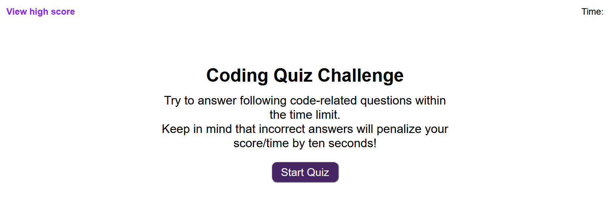

# Code-Quiz!!!

## Purpose

This quiz was developed to be used by potential employers as a tool evaluate a candidate's knowledge in certain areas of programming during an interview. The questions are designed to be multiple choice questions. This tool has following features.

* Time based point system (The timer starts as soon as the user start the quiz, wrong answer can cost them time and the final score would be the time left at the end of the quiz).

* The answer will be evaluated and displayed as soon as the user clicks on an answer option.

* The user can save their score as Highscore if they beat the previous highscore.

## Built With 🛠️

* HTML
* CSS
* JavaScript

## Website

https://thisaramallawaarachchige.github.io/code-quiz/

## Contribution

Made with ❤️ by Thisara MA
